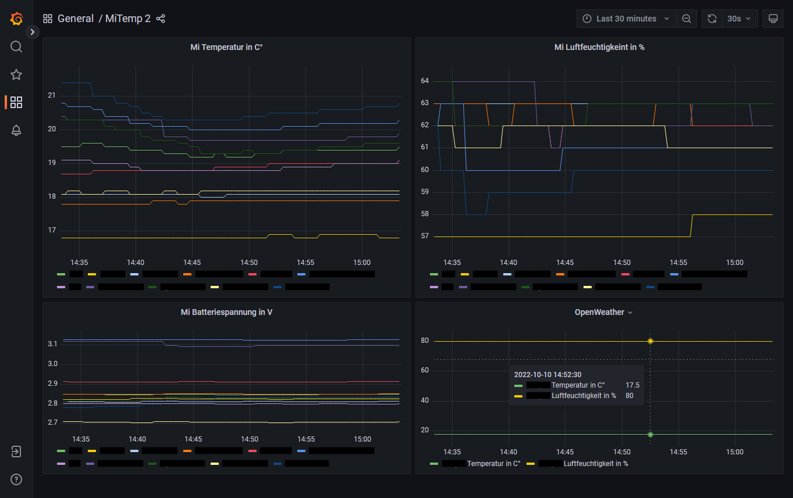

# Temperatur monitoring with Bluetooth LE and Prometheus/Grafana

## Requirements

-   XIAOMI Mijia Bluetooth Thermometer 2 flashed with https://github.com/atc1441/ATC_MiThermometer firmware
-   Linux (tested with Ubunut 22.04) machine with Bluetooth adapter
-   (optionally) OpenWeather API key (you can get a free one from https://openweathermap.org/)

## Installation

Adapt the configuration in `mitemp2-playbook.yml`:

```yaml
vars:
    openWeatherApiKey: 'abcdefghijklmnopq' # optional
    openWeatherCity: 'City,DE' # optional
    mi2Sensors:
        'A4:C1:38:12:34:56': Zimmer1
        'A4:C1:38:AB:CD:EF': Zimmer2
```

After that first run `sudo apt-get install ansible` and then `ansible-playbook mitemp2-playbook.yml --ask-become-pass` to install Docker, build the images and run them.

The Ansible playbook makes sure that Docker is installed (according to https://docs.docker.com/engine/install/ubuntu/). If Docker is already installed this is skipped.

**Note:** Building the images (especially `mitemp2`) takes quite a while.

**Note:** The `build-*.sh` files must be executable.

## Usage

http://host-name:3000/ for viewing the Grafana dashboard.



Prometheus retention time is set to 10 years (default would just be 15 days).

## Services

-   Prometheus Pushgateway: http://host-name:9091/ (UI allows to see if temperature metrics are pushed)
-   Prometheus: http://host-name:9090/ (scraping targets can be checked there)
-   OpenWeather Exporter: http://host-name:2112/metrics
